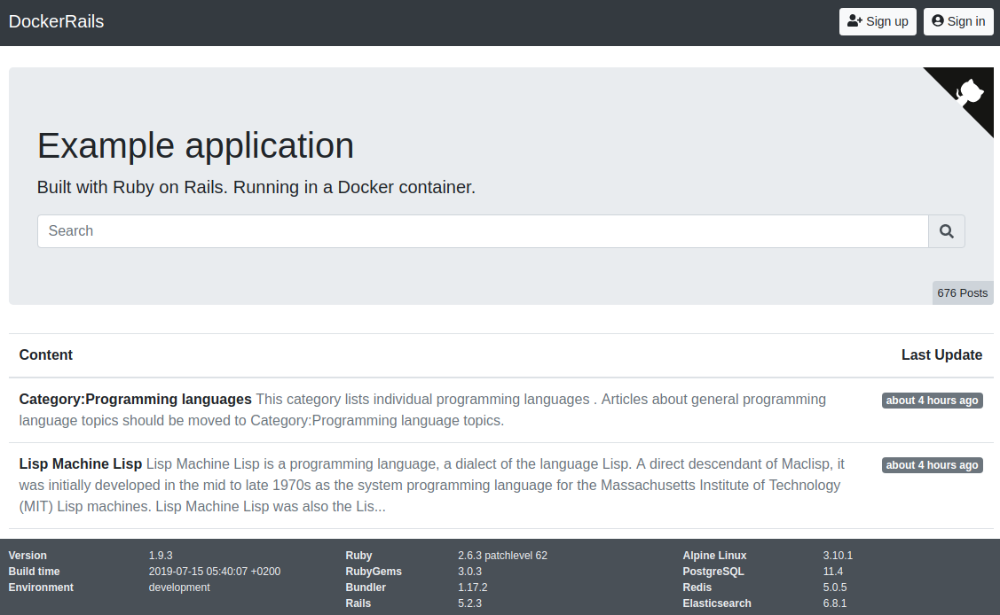

You just joined an established project and have been given access to the source code. Sometimes we find that it is easier to understand the structure of the project by looking into the database tables and the relations between them. Recently I found myself in this situation with a project that can be built **locally** with [Docker Compose](https://docs.docker.com/compose/). This is a note about what I did to glimpse in the project's tables.

# Setup

In order to allow readers to follow along for a more hands-on experience, we are going to use the Dockerize Rails app created by [Georg Ledermann](https://github.com/ledermann) as the "established project." The project already has a [`docker-compose.yml`](https://github.com/ledermann/docker-rails/blob/c7e0e5d8be469638d21cd13d500d4e5cd4873f8e/docker-compose.yml) setup that connects a PostgreSQL database to a Ruby on Rails application.



Let's setup the project locally by referring to the [Check it out!](https://github.com/ledermann/docker-rails/tree/c7e0e5d8be469638d21cd13d500d4e5cd4873f8e#check-it-out) section of the repository:

```console
$ git clone https://github.com/ledermann/docker-rails.git
$ cd docker-rails
$ docker-compose build
$ docker-compose run app yarn install
$ docker-compose up -d
```

At this point, you should have a few services running which you can check with the `docker-compose ps` command:

```console
$ docker-compose ps
            Name                          Command               State            Ports
-----------------------------------------------------------------------------------------------
docker-rails_app_1             docker/startup.sh                Up      0.0.0.0:32774->3000/tcp
docker-rails_db_1              docker-entrypoint.sh postgres    Up      5432/tcp
docker-rails_elasticsearch_1   /usr/local/bin/docker-entr ...   Up      9200/tcp, 9300/tcp
docker-rails_redis_1           docker-entrypoint.sh redis ...   Up      6379/tcp
docker-rails_worker_1          bundle exec sidekiq              Up      3000/tcp
```

If you want to checkout the web application that is running on your host, visit http://localhost:32774. Note that the value `32774` comes from the `Ports` column of `docker-rails_app_1` in the output of the `docker-compose ps`: container's port `3000` is exposed on the host's port `32774`.




# Start
$ docker-compose up -d


pgcli -h 172.24.0.4 -p 5432 -U postgres -d docker-rails_development

docker inspect docker-rails_db_1 | grep IPAddress

clean up


# Found a typo?

If you've found a typo, a sentence that could be improved or anything else that should be updated on this blog post, you can access it through a git repository and make a pull request. Instead of posting a comment, please go directly to <REPO URL> and open a new pull request with your changes.


