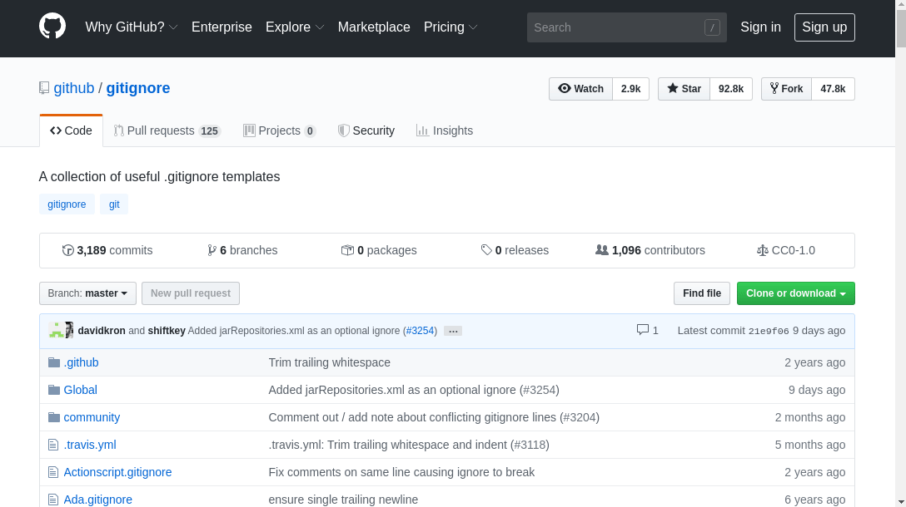

If you are using [`git`](https://git-scm.com/) in your project, you probably know what is `.gitignore`. Since I never seem to be able to memorized gitignore's [pattern format](https://git-scm.com/docs/gitignore#_pattern_format) correctly, when I needed to write a gitignore file for a specific project, I'll visit [github/gitignore](https://github.com/github/gitignore) in my web browser, search for gitignore file, open the file, copy its content, then finally paste it into my editor...



As we can imagine, if you need to create gitignore file for multiple programming languages the process becomes very tedious.

A while back I was introduced to [gitignore.io](https://www.gitignore.io/) which is a web service that allows us to create gitignore file easily for multiple languages. [gitignore.io](https://www.gitignore.io/) also provides API access and very nice [documentation](https://docs.gitignore.io/install/command-line) on how to run gitignore.io from your command line. It was a huge upgrade and I've been using this tool since then. I even submitted a PR to gitignore [direnv](https://github.com/direnv/direnv):



However, after the PR got merged, I found out that the change is not reflected in [gitignore.io](https://www.gitignore.io/) (yet). My guess is that the maintainer needs to "redeploy" the site in order to include the latest collections.

```
$ curl https://gitignore.io/api/direnv

# Created by https://www.gitignore.io/api/direnv
# Edit at https://www.gitignore.io/?templates=direnv

#!! ERROR: direnv is undefined. Use list command to see defined gitignore types !!#

# End of https://www.gitignore.io/api/direnv
```

gitignore.io's collections of gitignore templates are maintained in a separated repository: [github.com/toptal/gitignore](https://github.com/toptal/gitignore). They are extensions of [github/gitignore](https://github.com/github/gitignore) that include additional types known as `.patch`, `.stack`. When I bumped into the error above, I wondered if I can somehow generate the gitignore file using the repository directly without the web service. Which then lead me deep into the rabbit hole and created **gig**...



## Introducing **gig**

**gig** is a CLI port of [gitignore.io](https://www.gitignore.io/) and make use of the [large collection of .gitignore templates of gitignore.io](https://github.com/toptal/gitignore) mentioned above. This also means that **gig** supports all four file types that gitignore.io recognizes and generates contents of gitignore like gitignore.io does.

### Installing

If you are on macOS and are using Homebrew,

```
brew install shihanng/gig/gig
```

For other platforms, download the pre-built binaries from the [release page](https://github.com/shihanng/gig/releases) then place the binary in the `$PATH` e.g. `/usr/local/bin`.

### Using

The most direct way of using **gig** is to use the `gen` subcommand with a list of template names as arguments, e.g.

```
gig gen go terraform > .gitignore
```

Example above generates gitignore templates for [Go](https://golang.org/) and [Terraform](https://www.terraform.io/) then redirects those into `.gitignore` file. With additional `-f` flag, we can omit the redirect part of the command. **gig** command will cache the content of [github.com/toptal/gitignore](https://github.com/toptal/gitignore) repository into `$XDG_CACHE_HOME/gig` during the first run. This means that the next execute should work offline.



When we want to look for available templates, we can use the `list command`. It's a pretty long list, so it works better with a pager:

```
gig list | less
```

There is also a `search` command which calls [`fzf -m`](https://github.com/junegunn/fzf) internally on the list above and allows user to select (by pressing `tab` by default) the templates in fzf.



Finally there is the least useful `autogen` subcommand which was added just for fun.

```
gig autogen
```

It will look into the current directory and try to figure out what to gitignore. Internally it uses [source{d}'s enry package](https://github.com/src-d/enry) for programming language detection (which itself is a port of [GitHub's linguist](https://github.com/github/linguist)). Unfortunately it does not always work as expected:

- It is not able to detect framework, e.g. `.js` files will be detected as `javascript` but there is not **JavaScript** gitignore template available.
- `go.mod` and `go.sum` files will be detected as [**text**](https://github.com/github/linguist/blob/643c091e8d1e8c20401d1267ca558d304ebae8ca/lib/linguist/languages.yml#L5337-L5338) for the reason mentioned in [this PR](https://github.com/github/linguist/pull/4340).

---

**gig** started as a fun project to see how far I can go to build a CLI tool with the remix of

- [github.com/spf13/cobra](https://github.com/spf13/cobra): Go's framework for CLI,
- [github.com/src-d/go-git](https://github.com/src-d/go-git): Git implementation in Go,
- [github.com/src-d/enry](https://github.com/src-d/enry): for programming language detection,
- and many other libraries...

Now it is has become a tool that I will use it when starting a new project.

Please give it a try and I would love hear your feedback (via issues/PRs in [project repository](https://github.com/shihanng/gig) or comments in this post). If you like it, give it a ⭐ so that other people will hear about it.

Thanks for reading ❤️
