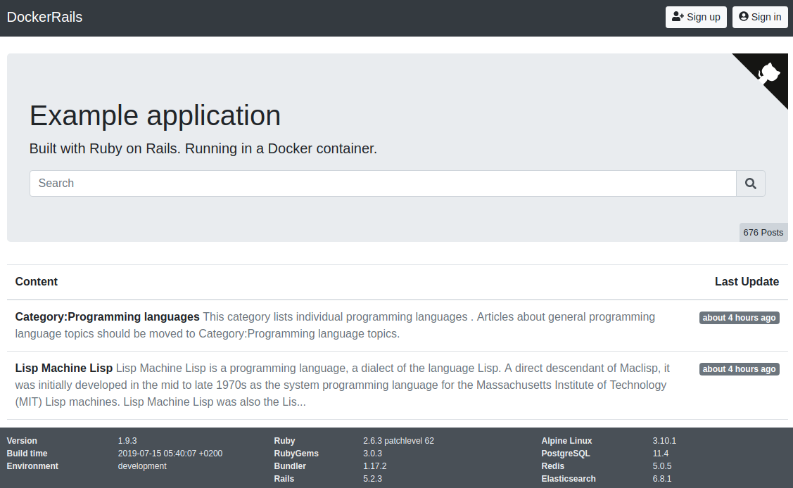
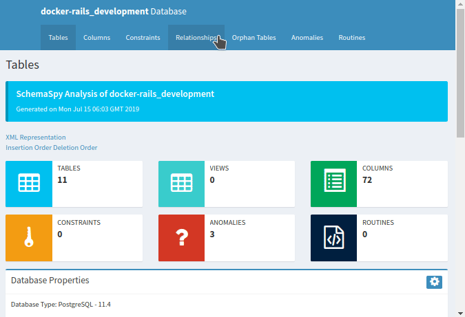

You just joined an established project and have been given access to the source code. Sometimes we find that it is easier to understand the structure of the project by looking into the database tables and the relations between them. Recently I found myself in this situation with a project that can be built **locally** with [Docker Compose](https://docs.docker.com/compose/). This is a note about what I did to glimpse in the project's tables.

# Setup

In order to allow readers to follow along for a more hands-on experience, we are going to use the Dockerize Rails app created by [Georg Ledermann](https://github.com/ledermann) as the "established project." The project already has a [`docker-compose.yml`](https://github.com/ledermann/docker-rails/blob/c7e0e5d8be469638d21cd13d500d4e5cd4873f8e/docker-compose.yml) setup that connects a PostgreSQL database to a Ruby on Rails application.



Let's setup the project locally by referring to the [Check it out!](https://github.com/ledermann/docker-rails/tree/c7e0e5d8be469638d21cd13d500d4e5cd4873f8e#check-it-out) section of the repository:

```console
$ git clone https://github.com/ledermann/docker-rails.git
$ cd docker-rails
$ docker-compose build
$ docker-compose run app yarn install
$ docker-compose up -d
```

At this point, you should have a few services running which you can check with the `docker-compose ps` command:

```console
$ docker-compose ps
            Name                          Command               State            Ports
-----------------------------------------------------------------------------------------------
docker-rails_app_1             docker/startup.sh                Up      0.0.0.0:32774->3000/tcp
docker-rails_db_1              docker-entrypoint.sh postgres    Up      5432/tcp
docker-rails_elasticsearch_1   /usr/local/bin/docker-entr ...   Up      9200/tcp, 9300/tcp
docker-rails_redis_1           docker-entrypoint.sh redis ...   Up      6379/tcp
docker-rails_worker_1          bundle exec sidekiq              Up      3000/tcp
```

If you want to checkout the web application that is running on your host, visit http://localhost:32774. Note that the value `32774` comes from the `Ports` column of `docker-rails_app_1` in the output of the `docker-compose ps`: container's port `3000` is exposed on the host's port `32774`.



# Accessing the Database

Here we will show how to access to the development database using two different tools:

1. [pgcli](https://www.pgcli.com/),
2. [SchemaSpy](https://github.com/schemaspy/schemaspy) for a more visualized approach.

Before doing so, we need to know the credentials for the database which can be found on the [`docker-compose.yml`](https://github.com/ledermann/docker-rails/blob/c7e0e5d8be469638d21cd13d500d4e5cd4873f8e/docker-compose.yml#L33-L34). The database that we are interested in is [`docker-rails_development`](https://github.com/ledermann/docker-rails/blob/c7e0e5d8be469638d21cd13d500d4e5cd4873f8e/config/database.yml#L27-L29). Let's export these value as environment variables:

```console
$ export DB_USER=postgres
$ export DB_PASSWORD=foobar123
$ export DB_NAME=docker-rails_development
```

## pgcli

Install `pgcli` based on the instructions in [official documentation](https://www.pgcli.com/install). Based on the information below we want to connect to the database (`docker-rails_db_1`) on port `5432`.

```console
$ docker-compose ps db
      Name                     Command              State    Ports
--------------------------------------------------------------------
docker-rails_db_1   docker-entrypoint.sh postgres   Up      5432/tcp
```

However the port is not exposed to the host. Therefore, doing the following will fail

```console
$ pgcli -h localhost -p 5432 -U "${DB_USER}" -d "${DB_NAME}"
could not connect to server: Connection refused
        Is the server running on host "localhost" (::1) and accepting
        TCP/IP connections on port 5432?
could not connect to server: Connection refused
        Is the server running on host "localhost" (127.0.0.1) and accepting
        TCP/IP connections on port 5432?
```

In this situation, we can use the IP address of the container instance to access the container without exposing the port to the host machine. The IP address can be obtained via

```console
$ docker inspect docker-rails_db_1 | grep IPAddress
            "SecondaryIPAddresses": null,
            "IPAddress": "",
                    "IPAddress": "172.24.0.4",
```

Using the IP address above, we can access the database via

```console
$ pgcli -h 172.24.0.4 -p 5432 -U "${DB_USER}" -d "${DB_NAME}"
Server: PostgreSQL 11.4
Version: 2.1.1
Chat: https://gitter.im/dbcli/pgcli
Mail: https://groups.google.com/forum/#!forum/pgcli
Home: http://pgcli.com
docker-rails_development>
```

## SchemaSpy

For SchemaSpy, we will try will a different approach: Using the [SchemaSpy's Docker container](https://hub.docker.com/r/schemaspy/schemaspy/) to connect to the existing database and generate the database diagrams for us. For this we need to know the name of the network created by docker-compose for this project:

```console
$ docker network list | grep docker-rails
27a3a7b42168        docker-rails_default   bridge              local
```

Now that we know the network name, we can use the `--net` option in the `docker run` command to connect the SchemaSpy container to the existing project network. The following will generate the database diagrams in the `db_out/` directory.

```console
$ export DB_HOST=docker-rails_db_1
$ export DB_NET=docker-rails_default
$ mkdir -p db_out
$ docker run --rm --net "${DB_NET}" \
  -v `pwd`/db_out:/output schemaspy/schemaspy:6.0.0 \
  -t pgsql \
  -db "${DB_NAME}" \
  -host "${DB_HOST}" \
  -port 5432 \
  -u "${DB_USER}" \
  -p "${DB_PASSWORD}"
```

Open `db_out/index.html` with a browser to checkout the generated diagrams.



# Cleanup

That's all for this post. The tricks mentioned above might seem limited to PostgreSQL but with little modification we believe that it can be applied on other types of databases too. As for cleanup, since it is a Docker Compose project, cleanup is as simple as:

```console
$ docker-compose stop
$ docker-compose rm
```

---

#### Found a typo?

Thank you for reading! Found a typo? See something that could be improved or anything else that should be updated on this blog post? Thanks to [this project](https://github.com/maxime1992/dev.to), you can easily create a pull request on https://github.com/shihanng/dev.to to propose a fix instead of posting a comment.
